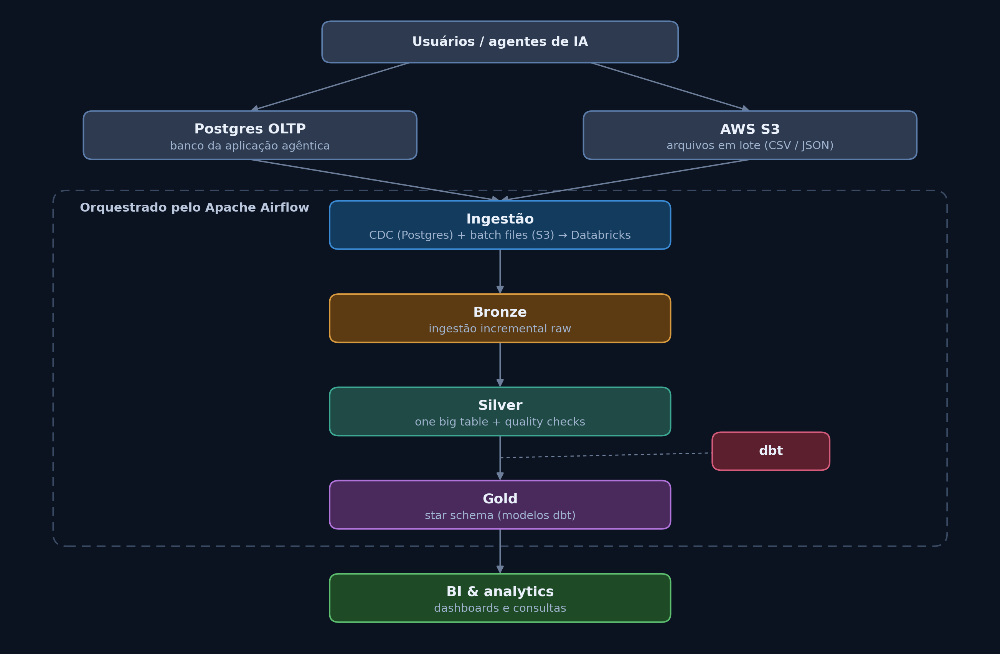

# Lakehouse E2E — Ingestão, Transformação e Orquestração

Projeto de engenharia de dados end-to-end simulando uma arquitetura moderna de Lakehouse, cobrindo ingestão incremental, modelagem em camadas (medallion), transformação com dbt e orquestração com Apache Airflow.

## Visão geral da arquitetura



O pipeline nasce em dois tipos de fonte — um banco operacional (Postgres, alimentado por uma aplicação/agente) e arquivos em lote no AWS S3 — e evolui através das camadas clássicas do Databricks Lakehouse até chegar em modelos analíticos prontos para consumo em BI.

## Componentes

| Camada | Descrição |
|---|---|
| **Fontes** | Postgres (OLTP, CDC) e AWS S3 (arquivos em lote) |
| **Ingestão** | Captura incremental via CDC (Postgres) e leitura de arquivos (S3), carregando dados brutos no Databricks |
| **Bronze** | Dados raw, ingestão incremental, sem transformação de negócio |
| **Silver** | Consolidação em uma "one big table", com testes e checks de qualidade |
| **Gold** | Modelagem dimensional (star schema), construída com dbt |
| **Orquestração** | Apache Airflow coordena todo o fluxo — ingestão, transformações dbt e validações |
| **Consumo** | Dashboards e consultas analíticas (BI) |

## Stack

- **Databricks / Unity Catalog** — armazenamento e processamento do Lakehouse
- **dbt** — transformação, testes e modelagem em camadas (staging → intermediate → marts)
- **Apache Airflow** — orquestração dos pipelines (ingestão e dbt runs)
- **AWS S3** — data lake para arquivos
- **PostgreSQL** — fonte transacional (OLTP)

## Conceitos aplicados

- Ingestão incremental (CDC + batch)
- Arquitetura medallion (Bronze → Silver → Gold)
- Slowly Changing Dimensions (SCD)
- Star Schema / modelagem dimensional
- Testes de qualidade de dados (dbt tests)
- Pipelines *metadata-driven*
- Orquestração com DAGs no Airflow

## Como rodar

> Preencher com os passos de setup do ambiente (Docker, variáveis de ambiente, credenciais do Databricks/AWS, `dbt deps`, etc.)

## Estrutura do repositório

```
.
├── dags/            # DAGs do Airflow
├── dbt/             # Projeto dbt (models, tests, snapshots)
├── ingestion/        # Scripts de ingestão incremental
├── docs/             # Documentação e diagramas
└── README.md
```

---
*Projeto de estudo, construído para praticar um stack moderno de engenharia de dados (Databricks, dbt, Airflow, AWS).*
